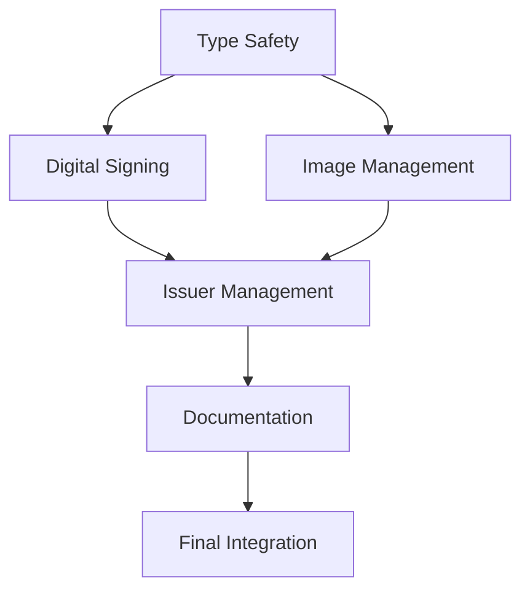

# Master Execution Plan

## Overview
This plan coordinates all tasks from todo and implementation details, organizing them into a logical sequence with dependencies and energy level considerations.

## Quick Reference
- 🔴 Not Started
- 🟡 In Progress
- 🟢 Completed
- 🔋 Low Energy Required
- 🔋🔋 Medium Energy Required
- 🔋🔋🔋 High Energy Required

## Phase 1: Foundation & Type Safety
**Timeline**: Weeks 1-2
**Goal**: Establish robust type safety and core functionality

### Week 1: Type System Foundations
**Energy Level Needed**: High 🔋🔋🔋
1. Initial Type Safety Setup (2-3 days)
   - [ ] Run type analysis
   - [ ] Set up core type definitions
   - [ ] Implement basic type guards
   - Related: `01-improve-type-safety.md`

2. Core Model Enhancement (2-3 days)
   - [ ] Update credential models
   - [ ] Implement JSON-LD types
   - [ ] Fix service layer types
   - Related: `implementation_details/typescript_error_fixes.md`

### Week 2: Schema & Test Infrastructure
**Energy Level Needed**: Medium 🔋🔋
1. Database Schema Cleanup (2-3 days)
   - [ ] Fix circular dependencies
   - [ ] Standardize type definitions
   - [ ] Update database queries

2. Test Infrastructure (2 days)
   - [ ] Clean up test types
   - [ ] Implement test utilities
   - [ ] Set up CI/CD pipelines

## Phase 2: Core Features Implementation
**Timeline**: Weeks 3-4
**Goal**: Implement critical badge functionality

### Week 3: Digital Signing
**Energy Level Needed**: High 🔋🔋🔋
1. Signing Infrastructure (3 days)
   - [ ] Set up cryptographic libraries
   - [ ] Implement key management
   - [ ] Create signing utilities
   - Related: `implementation_details/003-digital-signing.md`

2. Integration (2 days)
   - [ ] Connect signing to badge issuance
   - [ ] Implement verification endpoints
   - [ ] Add security measures

### Week 4: Image Management
**Energy Level Needed**: Medium 🔋🔋
1. Image Processing (3 days)
   - [ ] Set up image processing pipeline
   - [ ] Implement storage strategy
   - [ ] Create image utilities
   - Related: `implementation_details/004-enhanced-image-management.md`

2. Integration (2 days)
   - [ ] Connect to badge/issuer systems
   - [ ] Implement image endpoints
   - [ ] Add validation & optimization

## Phase 3: Issuer Management & Documentation
**Timeline**: Weeks 5-6
**Goal**: Complete issuer features and documentation

### Week 5: Issuer Management
**Energy Level Needed**: Medium to High 🔋🔋🔋
1. Core Implementation (3 days)
   - [ ] Implement issuer CRUD
   - [ ] Add validation logic
   - [ ] Create management interface
   - Related: `implementation_details/005-issuer-management-improvements.md`

2. Enhancement (2 days)
   - [ ] Add rate limiting
   - [ ] Implement caching
   - [ ] Security improvements

### Week 6: Documentation & Quality
**Energy Level Needed**: Low to Medium 🔋🔋
1. Documentation (3 days)
   - [ ] API documentation
   - [ ] Implementation guides
   - [ ] Usage examples
   - Related: `implementation_details/006-documentation-quality-assurance.md`

2. Quality Assurance (2 days)
   - [ ] Performance testing
   - [ ] Security audit
   - [ ] Standards compliance

## Phase 4: Final Integration & Testing
**Timeline**: Week 7
**Goal**: Ensure all components work together seamlessly

### Week 7: Integration & Launch Prep
**Energy Level Needed**: Medium to High 🔋🔋🔋
1. Integration Testing (3 days)
   - [ ] End-to-end testing
   - [ ] Load testing
   - [ ] Security testing

2. Launch Preparation (2 days)
   - [ ] Deployment documentation
   - [ ] Migration guides
   - [ ] Final QA checks

## Dependencies Map


## Energy Management Strategy

### High Energy Tasks (Do First in Day)
- Type system implementation
- Cryptographic systems
- Complex integrations
- Security features

### Medium Energy Tasks (Mid-Day)
- Image processing
- Database work
- Testing implementation
- API development

### Low Energy Tasks (End of Day)
- Documentation updates
- Simple bug fixes
- Code cleanup
- Test writing

## Progress Tracking
```markdown
# Weekly Progress Template
Week X (Date Range)

## Completed
- [ ] Task 1
  - [ ] Subtask A
  - [ ] Subtask B

## In Progress
- [ ] Task 2
  - [x] Subtask A
  - [ ] Subtask B

## Blocked
- [ ] Task 3
  - Blocker: Dependency X not ready

## Notes
- Challenges encountered
- Solutions found
- Things to consider
```

## Break Points
- Take 5-minute breaks between tasks
- 15-minute breaks between major tasks
- 30-minute lunch break
- Stop working if energy levels are consistently low

## Flexibility Notes
- Tasks can be reordered based on energy levels
- Some tasks can be worked on in parallel if energy permits
- It's okay to take longer if needed
- Quality is more important than speed

## Success Criteria
- [ ] All type safety improvements implemented
- [ ] Digital signing working end-to-end
- [ ] Image management fully functional
- [ ] Issuer management system complete
- [ ] Documentation comprehensive and clear
- [ ] All tests passing
- [ ] Performance metrics met
- [ ] Security requirements satisfied

## Support Tools
1. Time Management
   - Pomodoro timer
   - Calendar blocking
   - Progress tracking sheet

2. Focus Aids
   - Noise-canceling headphones
   - Do Not Disturb mode
   - Body doubling sessions

3. Documentation
   - Running notes document
   - Decision log
   - Problem-solution journal

## Emergency Procedures
If stuck or overwhelmed:
1. Take a 10-minute break
2. Write down the specific blocker
3. Break down the current task into smaller steps
4. Consider pair programming
5. Document the issue for future reference 